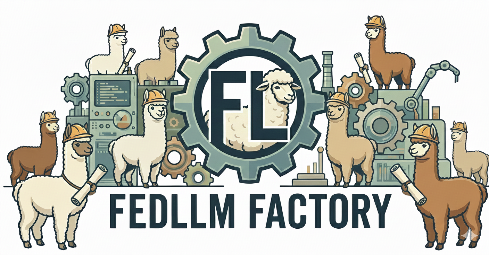
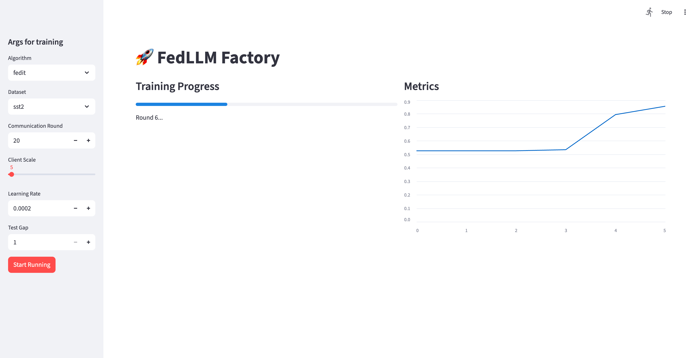

# FedLLM Factory

FedLLM Factory is a unified library for LoRA-based federated LLM fine-tuning.


### Supported Methods
Currently, it supports following 10+ baselines:

+ **FedIT**. Towards Building the Federated GPT: Federated Instruction Tuning. _ICASSP 2024_.
+ **FFA-LoRA**. Improving LoRA in Privacy-preserving Federated Learning. _ICLR 2024_.
+ **FLoRA**. FLoRA: Federated Fine-Tuning Large Language Models with Heterogeneous Low-Rank Adaptations. _NeurIPS 2024_.
+ **FlexLoRA**. Federated Fine-tuning of Large Language Models
under Heterogeneous Tasks and Client Resources. _NeurIPS 2024_.
+ **FedDPA**. Dual-Personalizing Adapter for Federated Foundation Models. _NeurIPS 2024_.
+ **FedSA-LoRA**. Selective Aggregation for Low-rank Adaptation in Federated Learning. _ICLR 2025_.
+ **FedEX-LoRA**. Exact Aggregation for Federated and Efficient
Fine-Tuning of Foundation Models. _ACL 2025_.
+ **FedSVD**. FedSVD: Adaptive Orthogonalization for Private Federated Learning with LoRA. _NeurIPS 2025_.
+ **RAVAN**. RAVAN: Multi-Head Low-Rank Adaptation for Federated Fine-Tuning. _NeurIPS 2025_.
+ **RoLoRA**. Robust Federated Finetuning of LLMs via Alternating Optimization of LoRA. _NeurIPS 2025_.
+ **FedLEASE**. Adaptive LoRA Experts Allocation and Selection for Federated Fine-Tuning. _NeurIPS 2025_.
+ **SLoRA**. SLoRA: Federated Parameter Efficient Fine-Tuning of Language Models. 2023.
+ **ILoRA**. ILoRA: Federated Learning with Low-Rank Adaptation for Heterogeneous Client Aggregation. 2025.
+ **FedRotLoRA**. FedRot-LoRA: Mitigating Rotational Misalignment in Federated LoRA. 2026.
+ **HiLoRA**. HiLoRA: Hierarchical Low-Rank Adaptation for Personalized Federated Learning. 2026.
+ **FedMomentum**. FedMomentum: Preserving LoRA Training Momentum in Federated Fine-Tuning. 2026.

Also, we support asynchronous version of federated LLM tuning.
To implement an asynchronous federated LLM fine-tuning algorithm, you can extend `asyncftbase.py`.

### General Steps
#### Step 1: Generate Dataset
You can split the dataset required for training.

1. Edit `dataset/config.yaml`.
2. Run `generate_{your dataset}.py` to generate your dataset.
```
cd dataset
python generate_{your dataset}.py
```

#### Step 2: Fine-tune Model
1. Edit `config.yaml`.
2. Run `main.py` for fine-tuning.
Note that you can attach args. 
The attached args will cover the parameters set in `config.yaml`. For example,
```
python main.py --alg fedit --epoch 1
```
The args can be configured in `utils/options.py`. 

### Supported Datasets
#### Natural Language Understanding (NLU)
+ **SST-2**
+ **IMDB**
#### Question Answering (QA)
+ **Dolly**
#### Mathematical Reasoning
+ **GSM8K**


### Frontend Usage
We also provide a simple frontend for users to easily run the code.
To use the frontend, you should install `streamlit` first.
Then, you can run the frontend by
```
streamlit run webui.py    
```

Then you can select the dataset, method, and other parameters in the frontend and click the "Start Running" button to start the fine-tuning process.




### To-Do List
+ Add more datasets, e.g., MMLU, C4, etc.
+ Add more baselines, scaling to 20+
+ Add more evaluation metrics, e.g., ROUGE, BLEU, etc.
+ Support rank heterogeneity